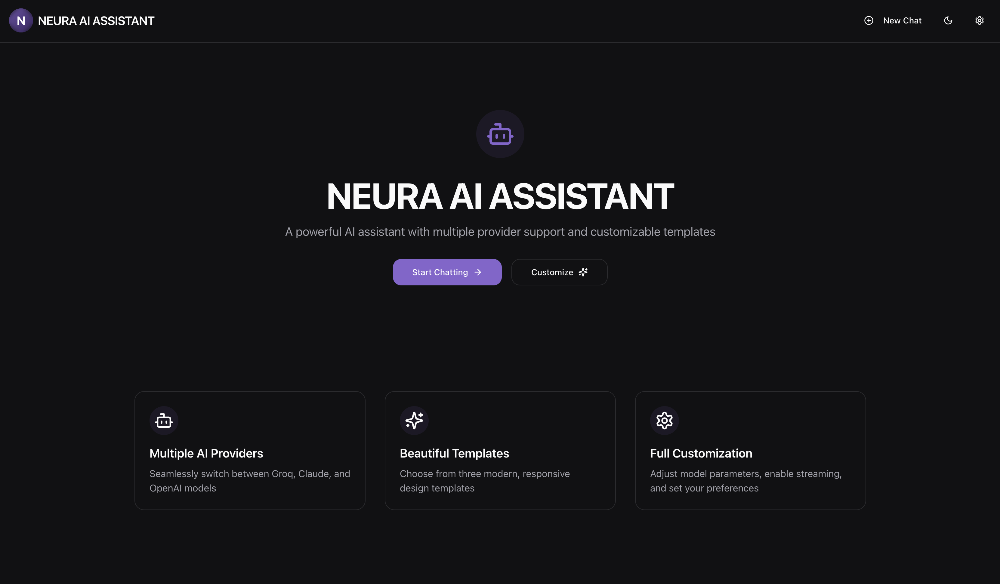
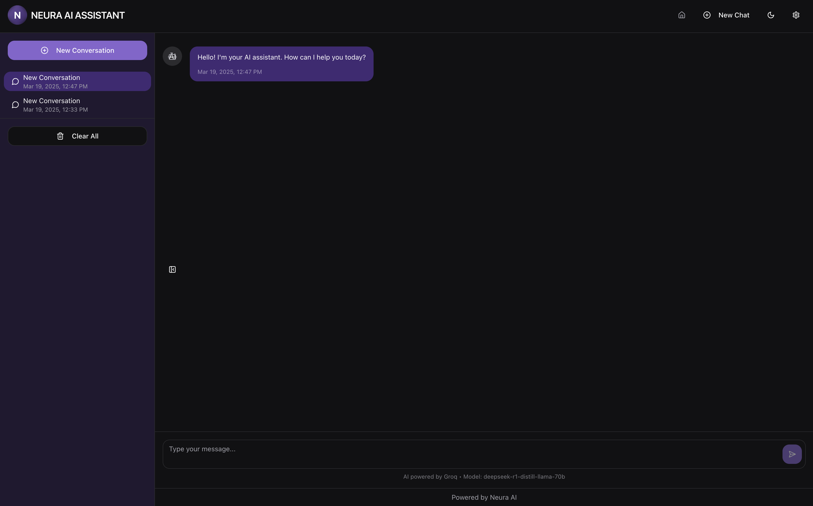
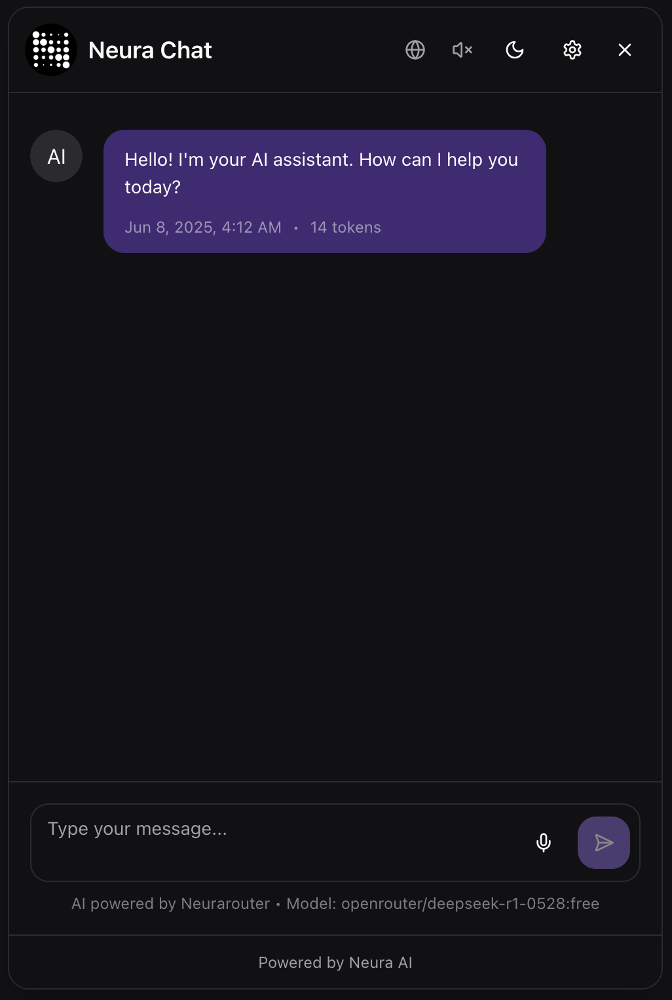
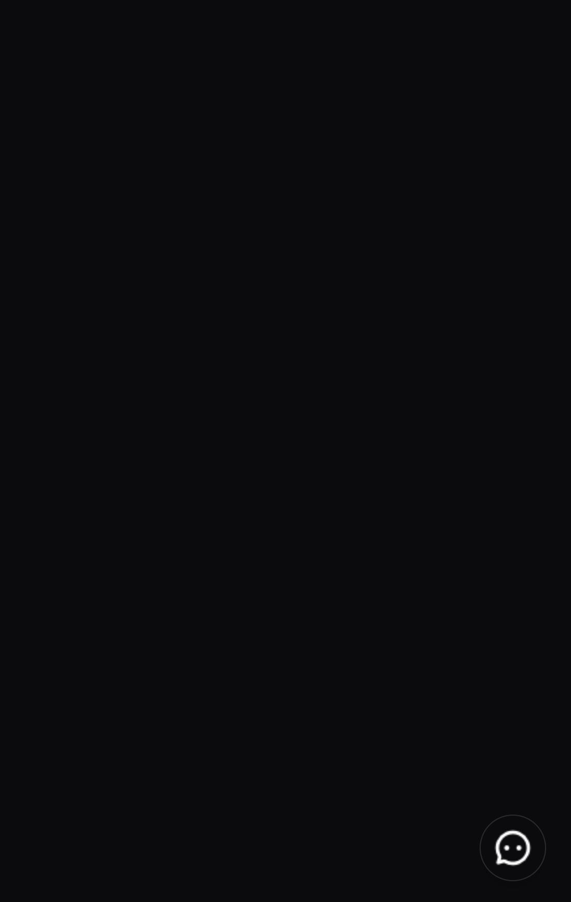
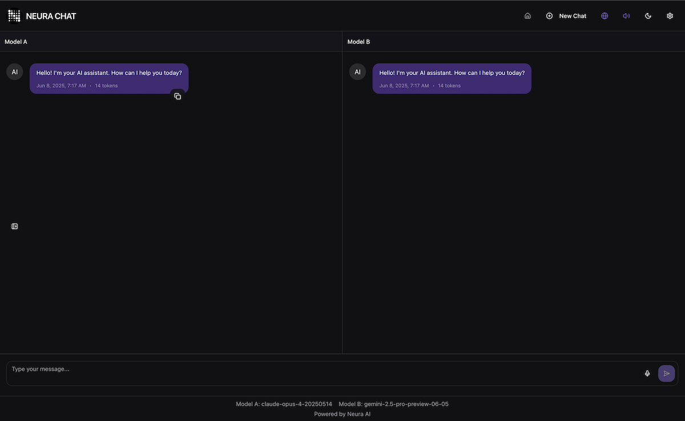

[](https://vite.dev)
[](https://docker.com)
[](https://prisma.io)
[](https://www.typescriptlang.org/)
[](https://shadcn.com) 
[](https://tailwindcss.com/)
[](https://eslint.org/)
[](https://prettier.io/)

[](https://open-source-chatbot-ui.meetneura.ai)[](https://meetneura.ai)

# Neura Spark Listener | Open-Source Chabot UI: A complete multi-service AI chat interface for everyone 🤝

## Overview

Neura Spark Listener is a modern, customizable open-source AI chatbot interface. It's built with Vite, React, TypeScript, shadcn UI, prisma DB, and more modern web technologies to provide an exceptional user experience.

Check comprehensive feature list below. 

## Features

- **Switch Easily Multiple AI Providers**: Seamlessly switch between Groq, Neura, Flowise, OpenRouter, Google, Antropic or OpenAI
- **Google Gemini Web Research**: Select web mode if you to research in real time with sources.
- **System Prompt Management**: Easily manage and switch between multiple system prompts.
- **Context Window Size Setting**: Choose from 1 pair to the last 10 pair to keep context with the apiService.
- **Enable Automatic Audio Playback Toggle**: Automatically play voice recording and assistant speech response, allowing for natural conversations with the user interface
- **Mermaid Diagram and Charts Support**: Display and download as .svg any Mermaid diagrams and charts in your conversations
- Boxed/Full Screen Mode: Allows users to switch between a boxed chatbot interface and a fullscreen experience.
- **Speech-to-Text**: Easily convert voice recordings to text
- **Text-to-Speech**: Convert text to speech to maintain voice conversations
- **Customizable Templates**: Choose from three modern visual templates (Minimal, Vibrant, and Elegant)
- **Dark/Light Mode**: Each template has both light and dark variants
- **Conversation Management**: Save, browse, and manage multiple chat conversations
- **Clear Conversation History**: Easily clear the entire chat history with a single button.
- **Auto-fit Input**: Automatically expands as you type, providing a comfortable writing experience while maintaining a clean interface.
- **Messages Token Counter**: Displays the number of tokens used in each message.
- **Messages Copying**: Users can easily copy AI-generated or user messages.
- **Stop Button**: Stop any stream at any time with a stop button in the text input area.
- **Scroll to Bottom**: Display a scroll to bottom once users scroll up in the conversation 
- **Scroll While Stream**:  Allow users to scroll while streaming 
- **Markdown Support**: Responses are displayed with Markdown formatting to improve readability and presentation.
Embed Feature: Easily embed the chatbot on any webpage with a simple script tag.
- **Edit Chat History Mesages**: Supports edit any message in the chat to get back at any point oin history
- **Persistent Storage**: Database-backed conversation history using Prisma ORM
- **Message Streaming**: Real-time message streaming for a responsive chat experience
- **Responsive Design**: Works smoothly on desktop and mobile devices
- **Customizable Settings**: Adjust parameters like temperature, model selection, and more
- Personalized Welcome Message: Allows defining a personalized welcome message to greet users upon entering the chat.

## Comming Soon

- Chat Arena: Comparison side by side between two different models
- User Account Management: Allow users to store and manage own conversations logging into their account
- Follow-up Prompts: Suggest follow-up questions to enhance user engagement.
- File Upload Support: Upload and process various file types including TXT, PDF, DOC, DOCX, CSV, JSON, and XML.
- Image Upload Support: Upload and process image files with preview functionality.
- Image Display: The chatbot can display images received in the conversation.
Attachment Preview: Shows thumbnails for uploaded images and file information for documents.
- File Size Limits: Enforces configurable size limits based on Flowise settings.
- Drag-and-Drop Functionality: Supports drag-and-drop for uploading files and images.
- Visual Feedback: Displays loading animations and progress indicators during operations.

## App Preview

### Home Page



### Desktop Chat View



### Chat Bubble Boxed View



### Chat Arena View




## Getting Started

### Prerequisites

- Node.js 16.x or higher
- npm or yarn package manager

### Installation

```bash
# Clone the repository
git clone https://github.com/adolfousier/neura-spark-listener-chatbot-ui
cd neura-ai

# Install dependencies
npm install
# or
yarn install
```

### Environment Variables

Create a `.env` file in the root directory with the following variables:

```
### Environment Variables

Create a `.env` file in the root directory based on the `.env.example` template. You can copy the example file and fill in your API keys:

```bash
cp .env.example .env
```

#### Required Variables

At least one AI service API key is required for the application to function:

```env
# At least one of these is required
VITE_GROQ_API_KEY=your_groq_api_key_here
VITE_OPENAI_API_KEY=your_openai_api_key_here
VITE_CLAUDE_API_KEY=your_claude_api_key_here
VITE_GOOGLE_API_KEY=your_google_api_key_here
VITE_OPENROUTER_API_KEY=your_openrouter_api_key_here
VITE_NEURA_ROUTER_API_KEY=your_neura_api_key_here
VITE_FLOWISE_API_KEY=your_flowise_api_key_here
```

#### Core Configuration

```env
# Database configuration (required)
DATABASE_URL="file:./db/dev.db"  # SQLite database path

# Application settings
VITE_PORT=4173  # Development server port
VITE_BOXED_CHATBUBBLE_MODE_ENABLED=true  # Enable boxed chat bubble interface
VITE_BACKEND_SERVICE_PROVIDER=groq  # Default AI service (groq, neura, openai, claude, google, openrouter, flowise)

# Streaming and response configuration
VITE_STREAM_ENABLED=true  # Enable/disable streaming responses
VITE_REASONING_FORMAT=parsed  # AI reasoning format (parsed, raw, or hidden)
```

#### Default Messages

```env
DEFAULT_SYSTEM_PROMPT="Your custom system prompt here"
DEFAULT_WELCOME_MESSAGE="Hello! I'm your AI assistant. How can I help you today?"
```

#### Service-Specific Configuration

**Groq Settings:**
```env
VITE_GROQ_API_MODEL=deepseek-r1-distill-llama-70b  # Default Groq model
VITE_GROQ_STT_API_MODEL=whisper-large-v3-turbo  # Speech-to-text model
```

**Google AI Settings:**
```env
VITE_GOOGLE_API_URL=https://generativelanguage.googleapis.com
VITE_GOOGLE_API_MODEL=gemini-2.5-pro-exp-03-25  # Default Google model
```

**Neura AI Settings:**
```env
VITE_NEURA_ROUTER_API_URL=https://api.meetneura.ai/v1/router/chat/completions
```

**OpenRouter Settings:**
```env
VITE_OPENROUTER_API_URL=https://openrouter.ai/api/v1/chat/completions
VITE_OPENROUTER_HTTP_REFERER=https://your-domain.com  # Your app's domain
VITE_OPENROUTER_X_TITLE=YourAppName  # Your app's name
```

**Flowise Settings:**
```env
VITE_FLOWISE_API_URL=https://your-flowise-instance.com/api/v1/prediction/
VITE_FLOWISE_CHATFLOW_ID=your_chatflow_id_here  # Specific chatflow ID
```

#### Optional Features

**Azure Storage (for file uploads):**
```env
VITE_AZURE_STORAGE_CONTAINER_ID=your_container_name
VITE_AZURE_STORAGE_ACCOUNT_NAME=your_storage_account_name
VITE_AZURE_STORAGE_SAS_TOKEN=your_sas_token_here
```

**Text-to-Speech Configuration:**
```env
VITE_OPENAI_TTS_API_MODEL=tts-1  # OpenAI TTS model
VITE_OPENAI_TTS_API_VOICE=shimmer  # Voice selection (alloy, echo, fable, onyx, nova, shimmer)
```

#### Getting API Keys

- **Groq**: Get your API key from [Groq Console](https://console.groq.com/)
- **OpenAI**: Get your API key from [OpenAI Platform](https://platform.openai.com/)
- **Anthropic Claude**: Get your API key from [Anthropic Console](https://console.anthropic.com/)
- **Google AI**: Get your API key from [Google AI Studio](https://aistudio.google.com/)
- **OpenRouter**: Get your API key from [OpenRouter](https://openrouter.ai/)
- **Neura AI**: Contact [Neura AI](https://meetneura.ai/) for API access
- **Flowise**: Set up your own Flowise instance or use a hosted service

#### Security Notes

- Never commit your `.env` file to version control
- Keep your API keys secure and rotate them regularly
- Use environment-specific configurations for development, staging, and production
- Consider using a secrets management service for production deployments
```

### Running the Development Server

```bash
npm run dev
# or
yarn dev
```

Open [http://localhost:8080](http://localhost:8080) in your browser to see the application.

### Building for Production

```bash
npm run build
# or
yarn build
```

The optimized production build will be in the `dist` folder.

## Architecture

The project is structured as follows:

- `/src/components` - UI components
- `/src/context` - React context providers
- `/src/hooks` - Custom React hooks
- `/src/lib` - Utility functions
- `/src/pages` - Page components
- `/src/services` - API services
- `/src/types` - TypeScript type definitions
- `/prisma` - Database schema and migrations

## Database Setup

This project uses Prisma ORM with SQLite for persistent storage of conversations and messages.

### Initialize the Database

```bash
# Install Prisma CLI if not already installed
npm install -g prisma

# Generate Prisma client
npx prisma generate

# Create and apply migrations to set up the database
npx prisma migrate dev --name init
```

### Database Schema

The database schema includes two main models:

- `Conversation`: Stores chat conversation metadata
- `Message`: Stores individual messages within conversations

You can view and modify the schema in the `prisma/schema.prisma` file.

## Contributing

Contributions are welcome! Please follow these steps:

1. Fork the repository
2. Create a feature branch (`git checkout -b feature/amazing-feature`)
3. Commit your changes (`git commit -m 'Add some amazing feature'`)
4. Push to the branch (`git push origin feature/amazing-feature`)
5. Open a Pull Request

### Code Style

We use ESLint and Prettier for code formatting. Please ensure your code follows our style guidelines by running:

```bash
npm run lint
npm run format
```

## Change Log

### v0.3.9 

-  Improved settings modal for when arena is selected and enabled in the .env flag

### v0.3.8 

- **Enter Chat Arena**: Fully implementation ready. In the next commit, final optimization to settings modal for when arena is set to true in the .env and selected in the UI

### v0.3.7

- Readme, compose and .env.example update

### v0.3.6 

- Implemented a DEFAULT_WELCOME_MESSAGE flag
- Improved the chatbubble adding settings, theme and web search dropdown

### v0.3.5 

- New Component Created : Added a new component `WebChatAssistant.tsx` . This component is responsible for:
- Displaying a chat bubble button using the /mingcute_chat.png image when the VITE_BOXED_CHATBUBBLE_MODE_ENABLED environment variable is set to true .
- Toggling a fixed-position, boxed chat window when the bubble is clicked.
- Integrating the existing `MessageList` and `MessageInput` components within this boxed UI.
- Ensuring that a chat conversation is active (either by selecting an existing one or creating a new one) when the chat window is opened, utilizing the `useChat` hook.
- Application Integration : The new `WebChatAssistant` component has been integrated into your main `App.tsx` . It's rendered conditionally based on the VITE_BOXED_CHATBUBBLE_MODE_ENABLED environment variable, allowing it to appear globally across your application when enabled.

### v0.3.4

**Fix**: Azure blob storage type missmatch 

### v0.3.3 

**apiService.ts Refactor**

### v0.3.2 

**Fix**: Mermaid rendering.

Key Changes:

- Zero Dependencies: useEffect([], []) - NO dependencies,
 renders once on mount only
- Global Cache: Results are cached in window.mermaidCache
 - same diagram never re-renders
- Direct DOM Manipulation: Uses innerHTML directly instea
d of React state
- Multiple Guards: hasRenderedRef, mountedRef prevent any
 re-execution
- Removed ALL React.memo: No more memoization complexity
- Removed useCallback: No more callback dependencies

### v0.3.1

**Fix**: README update and MarkdownRendered refactor

### v0.3.0

1.  **Updated AI Models**: Updated OpenAI, Anthropic, OpenRouter, Groq, and Neura models.
2.  **Fixed Diagram Resizing/Re-rendering Issue**: Workd better with Sonnet, Opus, o4-mini etc...
    *   Added `isRendered` state to prevent multiple renders of the same diagram.
    *   Used empty dependency array `[]` in Mermaid initialization to run only once.
    *   Added debouncing (300ms) to theme changes to prevent excessive re-renders.
    *   Improved responsive SVG handling by modifying the SVG attributes directly.
3.  **Added Mermaid SVG Download Functionality**:
    *   Added a Download button next to the copy button.
    *   Implemented `handleDownloadSVG` function that creates a blob and triggers download.
    *   The SVG file is named `mermaid-diagram-{diagramId}.svg`.
    *   Added proper tooltip for the download button.
    *   Debounced theme changes to avoid rapid re-initialization.
4.  **Chat ID's Browser Path**:
    *   Added a new `chatId` to the browser path

## License

This project is licensed under the MIT License - see the LICENSE file for details.

## Contribuitions
We welcome contributions! Please see our [contributing guidelines](contributing.md) for more information. If you like this project, please consider giving us a star!

## Acknowledgments

- This project uses [shadcn/ui](https://ui.shadcn.com/) for UI components
- Built with [Vite](https://vitejs.dev/), [React](https://reactjs.org/), and [TypeScript](https://www.typescriptlang.org/)
- Styled with [Tailwind CSS](https://tailwindcss.com/)
- Database with [Prisma ORM]([Prisma ORM](prisma.io/)